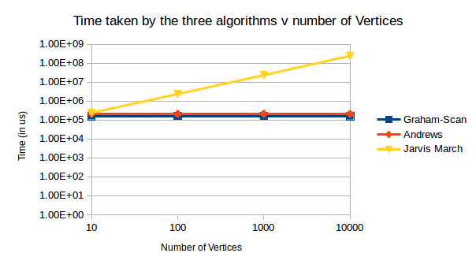

Number of Points|Graham-Scan time (in us)|Andrews time (in us)|Jarvis March time (in us)
--------------- | --------- | ----- | ----------
10|58|48|61.2
100|244|230.4|497.8
1000|2582|2480.8|8525.4
10000|19377.2|28994.2|65278.4
100000|163436.2|210378.2|792890.4
1000000|1761554.6|2252025.4|8781688.8

All the three algorithms were made to run on a given number of points 5 times, each time the points  were generated randomly, and the average of the running time was taken. From the graph, it is clear that Andrew’s and Graham Scan Algorithm are taking almost the same time for all the sets of points. On the other hand, Jarvis March on average takes more time than the other two algorithms. This is because the time consuming step in Graham and Andrews algorithm ,which is the step to sort the points , is run only once whereas in case of Jarvis March, the step to compute polar angle, takes the most time and is repeated a lot of times.

Number of vertices|Graham-Scan time (in us)|Andrews time (in us)|Jarvis March time (in us)
----------------- | --------- | ----- | ---------- 
10|161413|210374|238600
100|162104|209545|2369044
1000|162210|209957|23435829
10000|159654|209138|246883120

All the three algorithms were made to run on a given number of points 5 times, each time the points  were generated randomly, and the average of the running time was taken. From the graph, it is clear that Andrew’s and Graham Scan Algorithm are taking almost the same time for all the sets of points.    Also, Andrew’s and Graham Scan Algorithm take almost constant time for all the vertices, further stating that they are not output dependent. Whereas time taking by Jarvis March keeps on increasing for number of vertices, proving that it is an output dependent algorithm.
